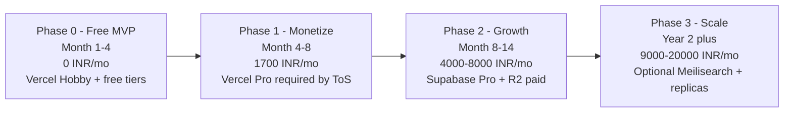
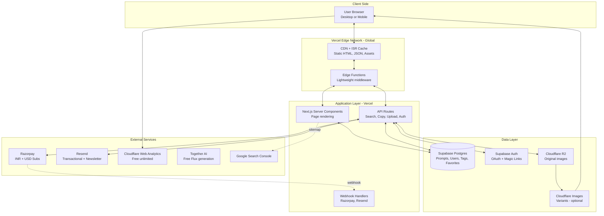
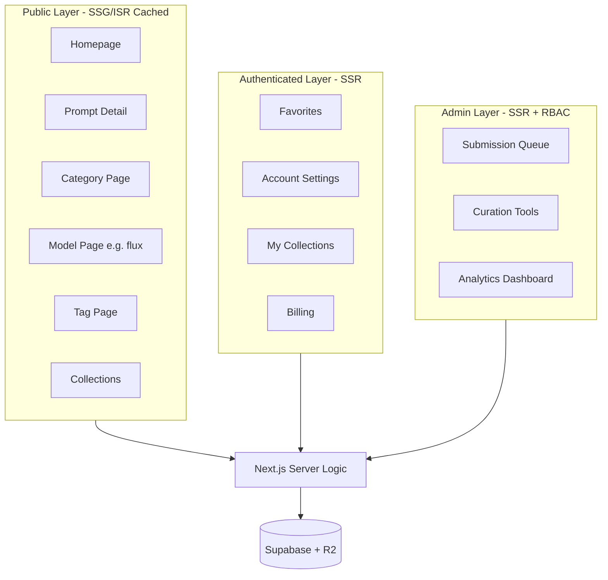
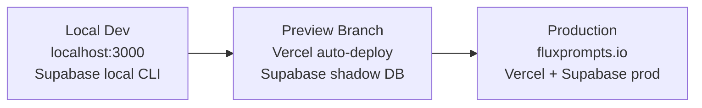
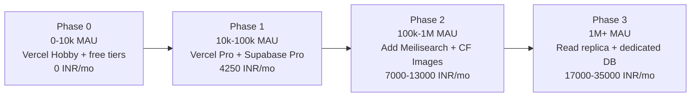
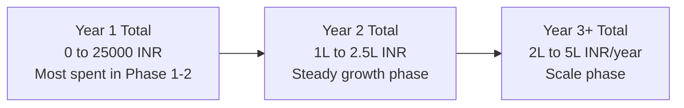

# 01 — High-Level Design (HLD)

> What we're building, why this shape, and how the pieces fit together at the system level.

## Table of Contents
1. [System Overview](#1-system-overview)
2. [Architecture Diagram](#2-architecture-diagram)
3. [Component Responsibilities](#3-component-responsibilities)
4. [Tech Stack & Rationale](#4-tech-stack--rationale)
5. [Three Logical Layers](#5-three-logical-layers)
6. [Deployment Topology](#6-deployment-topology)
7. [Caching & Performance Strategy](#7-caching--performance-strategy)
8. [Scaling Path](#8-scaling-path)
9. [Cost Model](#9-cost-model)
10. [Non-Functional Requirements](#10-non-functional-requirements)

---

## 1. System Overview

CopyPrompt is a **read-heavy, SEO-driven content site** with light write workloads (submissions, ratings, favorites). It is **not** a social network and not a real-time app — meaning we can lean hard on caching, static rendering, and edge delivery.

**Read:Write ratio expected:** ~99:1
**Hot path:** Anonymous user → search → detail page → copy button (no auth touched)
**Cold path:** Submit prompt, sign up, subscribe to premium

This shape is critical because it means:
- We optimize for **static + edge cached** delivery
- Database hits are minimized via ISR (Incremental Static Regeneration)
- We can run the whole thing on free tiers for a long time

## Cost Strategy: Free First, Pay When Forced

This entire system is designed to run on **₹0/month free tiers** until growth forces an upgrade. Year 1 budget realistically ranges from **₹0 to ₹25,000 total**, with most months at ₹0–₹2,000.

**Key cost-discipline rules:**
1. **Don't pay until the free tier is fully consumed.** Most services have generous limits.
2. **Don't pay for Vercel Pro until you turn on monetization.** Hobby tier prohibits commercial use, so the moment you add ads/premium, you must upgrade.
3. **Generate seed images for free** via Together AI's free Flux Schnell tier (6,000 images/day) — never pay for image generation upfront.
4. **Use Razorpay (not Stripe) for payments** — no monthly fee, individual mode means no business entity required, INR + USD support.

## 2. Architecture Diagram

## 3. Component Responsibilities

| Component | Responsibility | Free Tier | Cost After Free |
|-----------|----------------|-----------|------------------|
| **Next.js 15 (App Router)** | Page rendering, routing, API endpoints, server components | Open source | ₹0 forever |
| **Vercel (Hobby → Pro)** | Hosting, edge cache, serverless functions, ISR | Hobby: free for non-commercial only | Pro: ₹1,700/mo (required when you monetize) |
| **Supabase Postgres** | Primary DB for prompts, users, favorites, ratings | 500 MB DB, 50k MAU | Pro: ₹2,125/mo (8 GB DB) |
| **Supabase Auth** | User auth (Google, GitHub, magic link) | 50k MAU | Bundled with Pro |
| **Cloudflare R2** | Image storage (original + uploads) | 10 GB, 1M writes, 10M reads, **₹0 egress** | ~₹65–250/mo at 50 GB |
| **Cloudflare Images** *(optional)* | Image resizing, WebP/AVIF, variants | None — paid only | ₹420/mo for 100k images |
| **Together AI** *(seeding)* | Free Flux Schnell image generation API | 6,000 images/day on Schnell | Pay-per-token if exceeded (very cheap) |
| **Razorpay** | Premium subscriptions (INR + USD) | No monthly fee | 2% on cards, free on UPI |
| **Resend** | Transactional email + newsletter | 3,000 emails/month, 100/day | Pro: ₹1,700/mo (50k emails) |
| **Cloudflare Web Analytics** | Privacy-first analytics | **Unlimited, free forever** | Always ₹0 |
| **shadcn/ui + Tailwind** | UI components + styling | Open source | ₹0 forever |

## 4. Tech Stack & Rationale

### Why Next.js (and not Astro / SvelteKit / Remix)
- ISR is **critical** for prompt detail pages: 5,000+ pages, each can be statically generated and revalidated when stats change
- Server Components reduce JS bundle size — important for mobile users
- Vercel's zero-config deploys reduce ops overhead for a solo builder
- Largest ecosystem = fastest iteration

### Why Supabase (and not PlanetScale / Neon / Mongo)
- **Postgres full-text search** lets us launch search without a separate Algolia/Meilisearch dependency
- Auth, DB, Storage, Edge Functions in one dashboard
- Open-source escape hatch (self-host later if needed)
- Generous free tier; predictable pricing

### Why Cloudflare R2 + Images (and not S3 / Bunny / Cloudinary)
- **Zero egress fees** = at scale, this is the difference between ₹2,500/mo and ₹25,000/mo
- Cloudflare Images handles mobile-optimal variants automatically
- One vendor for storage + optimization + CDN
- **Free tier:** 10 GB storage, 1M writes, 10M reads per month — enough for 500–1000 prompts

### Why Postgres FTS for search (instead of Algolia / Meilisearch)
- `tsvector` + `ts_rank` is fast enough for ≤100k prompts
- Zero extra infrastructure to monitor
- Migrate to Meilisearch only if/when search latency exceeds 200ms p95
- Simple `GIN` index on a generated `tsvector` column gets us very far

## 5. Three Logical Layers

**Why this separation matters:**
- Public layer is statically cacheable → near-zero DB load for traffic
- Authenticated layer renders on-demand but is small audience
- Admin layer is RBAC-protected (Postgres Row Level Security)

## 6. Deployment Topology

- **Local:** `npm run dev` + `supabase start` (Docker) for DB
- **Preview:** every PR gets a Vercel preview URL pointing at a shadow Supabase project
- **Production:** main branch auto-deploys

## 7. Caching & Performance Strategy

| Layer | What | TTL | Invalidation |
|-------|------|-----|--------------|
| Vercel CDN | Homepage HTML | 60s | On-demand `revalidatePath` after admin actions |
| Vercel ISR | Prompt detail pages | 1 hour | On-demand revalidation when copy_count crosses thresholds |
| Vercel ISR | Category/tag/model pages | 6 hours | Daily cron or on submission approval |
| Edge cache | `/api/search` results | 60s | Vary by query string |
| Edge cache | `/api/trending` | 5 min | Cron-driven |
| Browser | Static assets, images | 1 year | Filename hashing |
| Cloudflare Images | Image variants | Forever | Per-image purge if updated |

**Performance budgets:**
- LCP < 1.5s on 4G mobile
- CLS < 0.05
- TTI < 2.5s
- Search response < 150ms p95

## 8. Scaling Path

> **Critical note on Vercel Hobby:** The free Hobby tier explicitly **prohibits commercial use** (running ads, charging money). This means **before you turn on monetization** (premium tier or AdSense), you MUST upgrade to Vercel Pro at ₹1,700/month. We accept this as a deferred cost — start free, upgrade exactly when revenue begins.

**Migration triggers (not blockers):**
- Adding monetization (ads/premium) → upgrade Vercel to Pro (₹1,700/mo) — required by ToS
- DB > 80% capacity (~400 MB) → upgrade Supabase to Pro (₹2,125/mo)
- Search p95 > 200ms → introduce Meilisearch (₹2,500/mo)
- DB CPU > 70% sustained → add read replica
- Vercel function invocations spike → move heavy paths to edge runtime

## 9. Cost Model (Free-First, ₹ INR)

> **Strategy:** Run on free tiers as long as possible. Pay only when forced by a real growth trigger or by adding monetization. **Year 1 cost ranges from ₹0 to ₹25,000 total**, depending on traction.

### Phase 0 — Free MVP (Months 1–4, pre-monetization)
**Goal: ₹0/month while building, seeding, and launching.**

| Item | Service | Free Tier Limit | Cost |
|------|---------|-----------------|------|
| Hosting | **Vercel Hobby** | Personal/non-commercial only | ₹0 |
| Database | **Supabase Free** | 500 MB DB, 1 GB storage, 50k MAU | ₹0 |
| Image storage | **Cloudflare R2 Free** | 10 GB, 1M writes, 10M reads | ₹0 |
| Image optimization | **Next.js `<Image>`** (built-in) | No external service | ₹0 |
| AI image generation (seeding) | **Together AI Free** + **Pollinations.ai** | 6,000 Flux Schnell images/day | ₹0 |
| Email | **Resend Free** | 3,000 emails/month, 100/day | ₹0 |
| Analytics | **Cloudflare Web Analytics** | Unlimited, no cookie banner | ₹0 |
| Domain | `.vercel.app` subdomain (or buy own) | Free subdomain | ₹0 (or ₹850/year for own domain) |
| **Total** | | | **₹0–₹70/month** |

### Phase 1 — Monetization Online (Months 4–8)
**Trigger:** You're ready to turn on premium subscriptions or AdSense.

| Item | Service | Why Upgrade Now | Cost |
|------|---------|-----------------|------|
| Hosting | **Vercel Pro** | Required by ToS for commercial use | ₹1,700/mo |
| Database | Supabase Free | Still under 500 MB if < 5,000 prompts | ₹0 |
| Image storage | R2 Free | Still under 10 GB | ₹0 |
| Domain (own) | Cloudflare Registrar | Brand credibility for paying users | ₹70/mo (₹850/year amortized) |
| AI image gen | Together AI Free | Still on free tier | ₹0 |
| Email | Resend Free | Still under 3k/mo | ₹0 |
| Analytics | Cloudflare Web Analytics | Free forever | ₹0 |
| Payments | Razorpay | No monthly fee, only transaction % | ₹0 fixed |
| **Total** | | | **₹1,770/month** |

### Phase 2 — Growth (Months 8–14)
**Triggers:** DB > 400 MB, R2 > 10 GB, or newsletter > 3k subs.

| Item | Service | Trigger | Cost |
|------|---------|---------|------|
| Hosting | Vercel Pro | (already paid) | ₹1,700/mo |
| Database | **Supabase Pro** | DB > 400 MB | ₹2,125/mo |
| Image storage | **R2 Paid** | > 10 GB stored | ₹65–250/mo |
| Image optimization | **Cloudflare Images** | > 200 prompts, want better mobile delivery | ₹420/mo |
| Email | **Resend Pro** | Newsletter > 3k subs | ₹0–₹1,700/mo |
| Domain | Own | (already paid) | ₹70/mo |
| AI image gen | Mostly free | Occasional fal.ai bursts | ₹0–₹1,700/mo |
| Analytics | CF Web Analytics | Free forever | ₹0 |
| **Total** | | | **₹4,380–₹7,965/month** |

### Phase 3 — Scaling (Year 2+)
**Triggers:** > 200k MAU, search latency issues.

| Item | Service | Cost |
|------|---------|------|
| Vercel Pro + extra bandwidth | | ₹1,700–₹5,000/mo |
| Supabase Pro + addons | | ₹2,125–₹6,400/mo |
| Cloudflare R2 + Images | | ₹850–₹2,500/mo |
| Meilisearch Cloud (if FTS too slow) | | ₹2,500/mo |
| Resend / ConvertKit (newsletter scale) | | ₹1,700–₹3,400/mo |
| **Total** | | **₹9,000–₹20,000/month** |

> At 200k+ MAU, your monetization (premium subs + affiliates + ads) should cover this 5–20x over.

### Year-by-Year Total Spend Estimate

## 10. Non-Functional Requirements

| NFR | Target | How We Achieve It |
|-----|--------|-------------------|
| **Performance** | LCP < 1.5s mobile | ISR + edge cache + image variants + minimal JS |
| **SEO** | All public pages SSR + meta + schema.org | Next.js `generateMetadata`, `sitemap.xml`, `robots.txt`, structured data |
| **Accessibility** | WCAG AA | shadcn/ui (Radix primitives), keyboard nav, semantic HTML |
| **Privacy** | No PII to ad tech, GDPR-compliant | Cloudflare Web Analytics (no cookies), Supabase EU/Asia region, consent only when needed |
| **Reliability** | 99.9% uptime | Vercel + Supabase SLA covers this; static fallbacks |
| **Security** | Standard web app hardening | Supabase RLS, rate limiting on writes, Razorpay/Stripe webhook signature verification |
| **Mobile** | First-class mobile UX | Mobile-first Tailwind breakpoints, touch-friendly hit areas, no hover-dependencies |
| **Cold start** | < 500ms | Vercel functions warmed by Edge; ISR handles bulk |
| **Cost discipline** | ₹0/mo until monetization, < ₹2,000/mo through Phase 1 | Strict free-tier-first; upgrade only when forced |

## Architectural Decisions Summary

| Decision | Choice | Alternative Rejected |
|----------|--------|----------------------|
| Framework | Next.js 15 App Router | Astro (less mature for dynamic content), SvelteKit (smaller ecosystem) |
| Database | Supabase Postgres | PlanetScale (discontinued free tier), Mongo (no FTS), Neon (no Auth bundled) |
| Search | Postgres FTS first | Algolia (₹2,500+/mo early), Meilisearch (extra ops) |
| Image storage | Cloudflare R2 | S3 (egress fees), Cloudinary (expensive at scale) |
| Hosting | Vercel (Hobby → Pro on monetization) | Cloudflare Pages (Next.js adapter friction), Netlify (smaller community) |
| Auth | Supabase Auth | Clerk (paid early), NextAuth (more setup) |
| Styling | Tailwind + shadcn/ui | CSS Modules (more code), Material UI (heavy bundle) |
| Analytics | Cloudflare Web Analytics (free forever) | Plausible (₹765/mo), GA4 (privacy issues) |
| AI image gen (seeding) | Together AI Free + Pollinations.ai | fal.ai paid (₹2/image), local Flux (needs 24GB VRAM GPU) |
| Payments | Razorpay (individual mode) | Stripe India (needs LLP/PVT LTD), Lemon Squeezy (5% fee) |

---

**Next:** [02-LLD.md](./02-LLD.md) — Database schema, API spec, and page routes.
