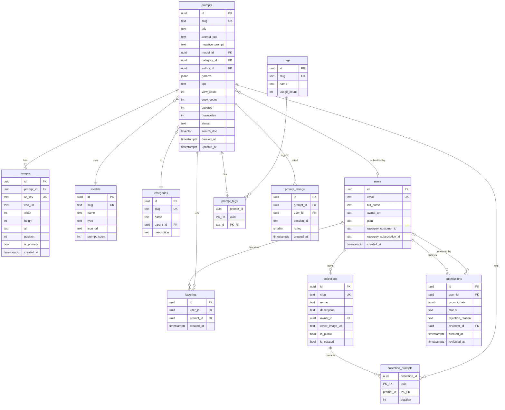
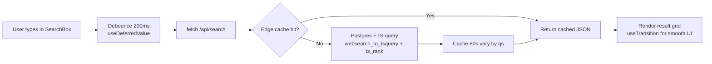

# 02 — Low-Level Design (LLD)

> Concrete data structures, endpoint contracts, and page routes — the level a developer needs to write code from.

## Table of Contents
1. [Database Schema (ER Diagram + Tables)](#1-database-schema)
2. [Indexes & Performance](#2-indexes--performance)
3. [API Endpoints](#3-api-endpoints)
4. [Page Routes (Next.js App Router)](#4-page-routes)
5. [Search Implementation](#5-search-implementation)
6. [Image Pipeline](#6-image-pipeline)
7. [Auth & Row-Level Security](#7-auth--row-level-security)
8. [Caching Keys & Invalidation](#8-caching-keys--invalidation)
9. [SEO Implementation](#9-seo-implementation)
10. [Folder Structure](#10-folder-structure)

---

## 1. Database Schema

### ER Diagram



### Table Specifications

#### `prompts` (the core table)
```sql
CREATE TABLE prompts (
  id              uuid PRIMARY KEY DEFAULT gen_random_uuid(),
  slug            text UNIQUE NOT NULL,
  title           text NOT NULL,
  prompt_text     text NOT NULL,
  negative_prompt text,
  model_id        uuid NOT NULL REFERENCES models(id),
  category_id     uuid NOT NULL REFERENCES categories(id),
  author_id       uuid REFERENCES users(id) ON DELETE SET NULL,
  params          jsonb DEFAULT '{}'::jsonb,
  tips            text,
  view_count      int  NOT NULL DEFAULT 0,
  copy_count      int  NOT NULL DEFAULT 0,
  upvotes         int  NOT NULL DEFAULT 0,
  downvotes       int  NOT NULL DEFAULT 0,
  status          text NOT NULL DEFAULT 'published'
                       CHECK (status IN ('draft','published','hidden')),
  search_doc      tsvector GENERATED ALWAYS AS (
                    setweight(to_tsvector('english', coalesce(title,'')), 'A') ||
                    setweight(to_tsvector('english', coalesce(prompt_text,'')), 'B') ||
                    setweight(to_tsvector('english', coalesce(tips,'')), 'C')
                  ) STORED,
  created_at      timestamptz NOT NULL DEFAULT now(),
  updated_at      timestamptz NOT NULL DEFAULT now()
);
```

**`params` jsonb** holds model-specific parameters such as:
```json
{
  "aspect_ratio": "16:9",
  "steps": 30,
  "guidance": 3.5,
  "model_variant": "flux-dev",
  "seed": 12345
}
```

#### `images`
```sql
CREATE TABLE images (
  id          uuid PRIMARY KEY DEFAULT gen_random_uuid(),
  prompt_id   uuid NOT NULL REFERENCES prompts(id) ON DELETE CASCADE,
  r2_key      text UNIQUE NOT NULL,
  cdn_url     text NOT NULL,
  width       int  NOT NULL,
  height      int  NOT NULL,
  alt         text,
  position    int  NOT NULL DEFAULT 0,
  is_primary  bool NOT NULL DEFAULT false,
  created_at  timestamptz NOT NULL DEFAULT now()
);
```

#### `models`
Seeded with: `flux-dev`, `flux-schnell`, `flux-pro`, `midjourney`, `stable-diffusion-xl`, `dall-e-3`, `chatgpt`, `claude`, etc.

#### `categories`
Hierarchical via `parent_id`. Examples:
- Image Generation → Cinematic Portraits, Product Photography, Logo Design, Architecture, Anime, Fantasy
- (Later) ChatGPT → Coding, Writing, Marketing
- (Later) Claude → Analysis, Writing

#### `users`
- `plan` enum-like: `'free' | 'premium' | 'admin'`
- Synced with Supabase `auth.users` via trigger on signup

#### `submissions`
Holds pending submissions before they become real prompts. Decoupling prevents user submissions from polluting `prompts` until reviewed.

```json
// submissions.prompt_data shape
{
  "title": "...",
  "prompt_text": "...",
  "negative_prompt": "...",
  "model_slug": "flux-dev",
  "category_slug": "cinematic-portraits",
  "tag_slugs": ["portrait", "neon", "cyberpunk"],
  "params": { ... },
  "tips": "...",
  "image_keys": ["uploads/abc.jpg", "uploads/def.jpg"]
}
```

## 2. Indexes & Performance

```sql
-- Search performance
CREATE INDEX idx_prompts_search_doc      ON prompts USING GIN (search_doc);
CREATE INDEX idx_prompts_status_created  ON prompts (status, created_at DESC);
CREATE INDEX idx_prompts_model_status    ON prompts (model_id, status);
CREATE INDEX idx_prompts_category_status ON prompts (category_id, status);
CREATE INDEX idx_prompts_copy_count      ON prompts (copy_count DESC) WHERE status = 'published';

-- Joins
CREATE INDEX idx_images_prompt_id        ON images (prompt_id, position);
CREATE INDEX idx_prompt_tags_prompt      ON prompt_tags (prompt_id);
CREATE INDEX idx_prompt_tags_tag         ON prompt_tags (tag_id);

-- User-specific
CREATE INDEX idx_favorites_user          ON favorites (user_id, created_at DESC);
CREATE UNIQUE INDEX uq_favorites_user_prompt ON favorites (user_id, prompt_id);

-- Ratings (anti-double-vote)
CREATE UNIQUE INDEX uq_rating_user_prompt    ON prompt_ratings (user_id, prompt_id) WHERE user_id IS NOT NULL;
CREATE UNIQUE INDEX uq_rating_session_prompt ON prompt_ratings (session_id, prompt_id) WHERE user_id IS NULL;
```

## 3. API Endpoints

### Public (no auth)

| Method | Path | Purpose | Cache |
|--------|------|---------|-------|
| GET | `/api/search` | Instant search (FTS + filters) | edge 60s, vary by qs |
| GET | `/api/trending` | Top prompts by copy_count last 7d | edge 5min |
| GET | `/api/prompts/[slug]` | (rare; usually SSR) | none |
| POST | `/api/prompts/[id]/copy` | Increment copy_count | none |
| POST | `/api/prompts/[id]/rate` | Thumbs up/down | none |

### `/api/search` — Detailed Spec

**Request:**
```
GET /api/search?q=cinematic+portrait&model=flux&category=portraits&sort=popular&page=1
```

**Query params:**
- `q` (string, optional) — full-text query
- `model` (string, optional) — model slug (`flux`, `midjourney`, etc.)
- `category` (string, optional) — category slug
- `tag` (string, repeatable) — tag slug filter
- `sort` (`popular` | `latest` | `trending`, default `popular`)
- `page` (int, default 1)

**Response:**
```json
{
  "results": [
    {
      "id": "uuid",
      "slug": "cinematic-cyberpunk-portrait",
      "title": "Cinematic Cyberpunk Portrait",
      "prompt_text": "...",
      "thumbnail_url": "https://images.example.com/...",
      "primary_image": {
        "cdn_url": "...",
        "width": 1024,
        "height": 1024
      },
      "model": { "slug": "flux-dev", "name": "Flux Dev" },
      "category": { "slug": "cinematic-portraits", "name": "Cinematic Portraits" },
      "stats": { "copy_count": 1234, "upvotes": 89 }
    }
  ],
  "page": 1,
  "page_size": 24,
  "total": 1248,
  "has_more": true
}
```

**Implementation:**
```sql
SELECT p.*, COALESCE(ts_rank(p.search_doc, q), 0) AS rank
FROM prompts p
CROSS JOIN websearch_to_tsquery('english', $1) q
WHERE p.status = 'published'
  AND ($1 = '' OR p.search_doc @@ q)
  AND ($2::uuid IS NULL OR p.model_id = $2)
  AND ($3::uuid IS NULL OR p.category_id = $3)
ORDER BY
  CASE WHEN $4 = 'popular' THEN p.copy_count END DESC NULLS LAST,
  CASE WHEN $4 = 'latest'  THEN p.created_at END DESC NULLS LAST,
  rank DESC
LIMIT 24 OFFSET (($5 - 1) * 24);
```

### Authenticated (Supabase JWT)

| Method | Path | Purpose |
|--------|------|---------|
| POST | `/api/submit` | Create submission |
| POST | `/api/upload` | Get presigned R2 PUT URL |
| GET | `/api/favorites` | List user favorites |
| POST | `/api/favorites` | Add favorite |
| DELETE | `/api/favorites/[promptId]` | Remove favorite |
| POST | `/api/favorites/sync` | Sync localStorage IDs to DB after signup |
| GET | `/api/account/me` | Current user |
| POST | `/api/billing/checkout` | Create Razorpay subscription order |
| POST | `/api/billing/cancel` | Cancel active Razorpay subscription |

### Webhooks

| Method | Path | Source |
|--------|------|--------|
| POST | `/api/razorpay/webhook` | Razorpay (HMAC signature-verified) |
| POST | `/api/resend/webhook` | Resend (signature-verified) |

### Admin (RBAC: `users.plan = 'admin'`)

| Method | Path | Purpose |
|--------|------|---------|
| GET | `/api/admin/queue` | List pending submissions |
| POST | `/api/admin/submissions/[id]/approve` | Approve → creates prompt + images |
| POST | `/api/admin/submissions/[id]/reject` | Reject with reason |
| POST | `/api/admin/prompts/[id]/feature` | Mark "Prompt of the Day" |

## 4. Page Routes

Next.js 15 App Router structure:

```
app/
├─ layout.tsx                    Root layout (dark mode, fonts)
├─ page.tsx                       /                          Homepage
├─ search/
│  └─ page.tsx                   /search                    Search results
├─ prompt/[slug]/
│  └─ page.tsx                   /prompt/[slug]             Detail page (ISR 1hr)
├─ model/[slug]/
│  └─ page.tsx                   /model/[slug]              e.g. /model/flux
├─ category/[slug]/
│  └─ page.tsx                   /category/[slug]
├─ tag/[slug]/
│  └─ page.tsx                   /tag/[slug]
├─ collections/
│  ├─ page.tsx                   /collections
│  └─ [slug]/page.tsx            /collections/[slug]
├─ submit/
│  └─ page.tsx                   /submit                    Submit form
├─ favorites/
│  └─ page.tsx                   /favorites                 (auth optional)
├─ pricing/
│  └─ page.tsx                   /pricing
├─ account/
│  ├─ page.tsx                   /account
│  └─ billing/page.tsx           /account/billing
├─ admin/
│  ├─ layout.tsx                 (RBAC guard)
│  ├─ queue/page.tsx             /admin/queue
│  └─ prompts/page.tsx           /admin/prompts
├─ about/page.tsx
├─ privacy/page.tsx
├─ terms/page.tsx
├─ sitemap.ts                    Generates sitemap.xml dynamically
├─ robots.ts                     Generates robots.txt
└─ api/
   ├─ search/route.ts
   ├─ trending/route.ts
   ├─ prompts/[id]/copy/route.ts
   ├─ prompts/[id]/rate/route.ts
   ├─ submit/route.ts
   ├─ upload/route.ts
   ├─ favorites/route.ts
   ├─ razorpay/webhook/route.ts
   └─ admin/...
```

## 5. Search Implementation



**Key implementation details:**
- Use `websearch_to_tsquery` (handles "exact phrases", -negation, OR)
- `ts_rank` weighted: title (A) > prompt_text (B) > tips (C)
- Debounce 200ms client-side; abort previous in-flight request via `AbortController`
- Render results as a transition (`useTransition`) so input stays responsive
- Pre-fetch top results on hover (`<Link prefetch>`)

**Migration trigger to Meilisearch/Typesense:**
- p95 query latency > 200ms sustained, OR
- > 50k prompts and complex faceting required, OR
- typo tolerance becomes a major UX gap

## 6. Image Pipeline

```mermaid
flowchart LR
    User[User drops image<br/>in submit form] --> Client[Client-side validation<br/>size, type, dim]
    Client --> Presign[POST /api/upload<br/>get presigned R2 URL]
    Presign --> Direct[Browser PUTs directly<br/>to R2 - no server hop]
    Direct --> R2[(R2 bucket: uploads/)]
    R2 --> Submit[POST /api/submit<br/>with R2 keys]
    Submit --> Queue[(submissions table<br/>status=pending)]
    Queue --> Admin[Admin approves]
    Admin --> Move[Move R2 keys<br/>uploads/ to prompts/]
    Move --> Variants[Cloudflare Images<br/>generates thumb/hero/og variants]
    Variants --> CDN[Served via cdn.fluxprompts.io]
```



**Variants generated:**
- `thumb` — 400×400 cropped (grid view)
- `card` — 800×800 (search results)
- `hero` — 1600×1600 (detail page)
- `og` — 1200×630 (social share)
- AVIF + WebP + JPEG fallback automatically

**Validation:**
- Max 10MB per image
- Allowed: JPEG, PNG, WebP
- Min 512×512, max 4096×4096
- 1–3 images per prompt
- Server re-checks size/dimensions after upload

## 7. Auth & Row-Level Security

### Auth providers
- Email magic link (Supabase default)
- Google OAuth
- GitHub OAuth (optional)

### RLS Policies (Postgres)

```sql
-- Public can read published prompts
CREATE POLICY "public read prompts"
  ON prompts FOR SELECT
  USING (status = 'published');

-- Only owner can read own submissions
CREATE POLICY "own submissions read"
  ON submissions FOR SELECT
  USING (auth.uid() = user_id);

-- Only admins can update prompts
CREATE POLICY "admin update prompts"
  ON prompts FOR UPDATE
  USING (
    EXISTS (
      SELECT 1 FROM users WHERE id = auth.uid() AND plan = 'admin'
    )
  );

-- Users manage their favorites only
CREATE POLICY "users own favorites"
  ON favorites FOR ALL
  USING (auth.uid() = user_id);
```

### Session shape (Supabase JWT)
```json
{
  "sub": "user-uuid",
  "email": "user@example.com",
  "user_metadata": { "full_name": "...", "avatar_url": "..." },
  "app_metadata": { "plan": "premium" }
}
```

## 8. Caching Keys & Invalidation

| Key | Used by | TTL | Invalidate when |
|-----|---------|-----|-----------------|
| `route:/` | Homepage HTML | 60s ISR | New "Prompt of the Day", trending refresh |
| `route:/prompt/[slug]` | Detail page | 1h ISR | View/copy crosses 10x threshold; manual revalidation |
| `route:/model/[slug]` | Model page | 6h ISR | New approved prompt for that model |
| `route:/category/[slug]` | Category page | 6h ISR | New approved prompt for that category |
| `tag:trending` | `/api/trending` | 5min edge | Cron-driven |
| `tag:search:{hash}` | `/api/search` | 60s edge | Auto-expires |

```typescript
import { revalidatePath, revalidateTag } from 'next/cache';

await revalidatePath(`/prompt/${slug}`);
await revalidateTag('trending');
```

## 9. SEO Implementation

### Per-page meta
Every page exports `generateMetadata`:

```typescript
export async function generateMetadata({ params }): Promise<Metadata> {
  const prompt = await getPrompt(params.slug);
  return {
    title: `${prompt.title} — Flux Prompt | CopyPrompt`,
    description: truncate(prompt.prompt_text, 160),
    openGraph: {
      title: prompt.title,
      images: [{ url: prompt.og_image_url, width: 1200, height: 630 }],
      type: 'article',
    },
    twitter: { card: 'summary_large_image' },
    alternates: { canonical: `https://fluxprompts.io/prompt/${prompt.slug}` },
  };
}
```

### Structured data (schema.org JSON-LD)
- `ImageObject` for each prompt image
- `WebPage` + `BreadcrumbList`
- `Product` markup for premium tier on `/pricing`

### Programmatic SEO surfaces
- `/model/[slug]` — e.g. "Best Flux Prompts"
- `/category/[slug]` — e.g. "Best Cinematic Portrait Prompts"
- `/tag/[slug]` — e.g. "neon prompts"
- `/style/[slug]` — e.g. "cyberpunk style prompts" (style is derived/curated)

### Sitemaps
- `sitemap.xml` (root) — index of nested sitemaps
- `sitemap-prompts.xml` — chunked, 50k URLs per file
- `sitemap-categories.xml`, `sitemap-models.xml`, `sitemap-tags.xml`

## 10. Folder Structure

```
fluxprompts/
├─ app/                        Next.js routes
├─ components/
│  ├─ ui/                      shadcn components
│  ├─ search/                  SearchBox, ResultsGrid, FilterPanel
│  ├─ prompt/                  PromptCard, PromptDetail, CopyButton
│  ├─ submit/                  SubmitForm, ImageDropzone
│  └─ layout/                  Header, Footer, Nav
├─ lib/
│  ├─ supabase/                client.ts, server.ts, admin.ts
│  ├─ r2.ts                    R2 client + presigning
│  ├─ razorpay.ts             Razorpay client + webhook verifier
│  ├─ search.ts                Search query builder
│  ├─ analytics.ts             Cloudflare Web Analytics wrapper
│  └─ utils.ts
├─ db/
│  ├─ migrations/              SQL migrations
│  └─ seed.ts                  Seed script for models, categories, tags
├─ public/
├─ docs/                       (this folder)
├─ next.config.js
├─ tailwind.config.ts
├─ middleware.ts               Auth + rate limit
└─ package.json
```

---

**Next:** [03-USER-FLOWS.md](./03-USER-FLOWS.md) — what the user sees and does, step-by-step.
