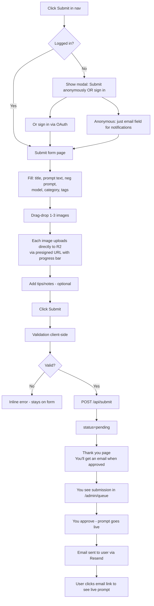
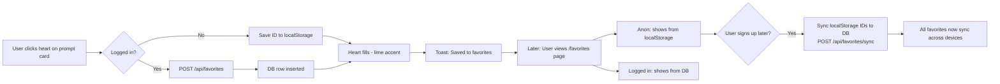
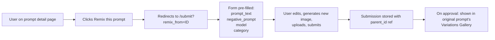
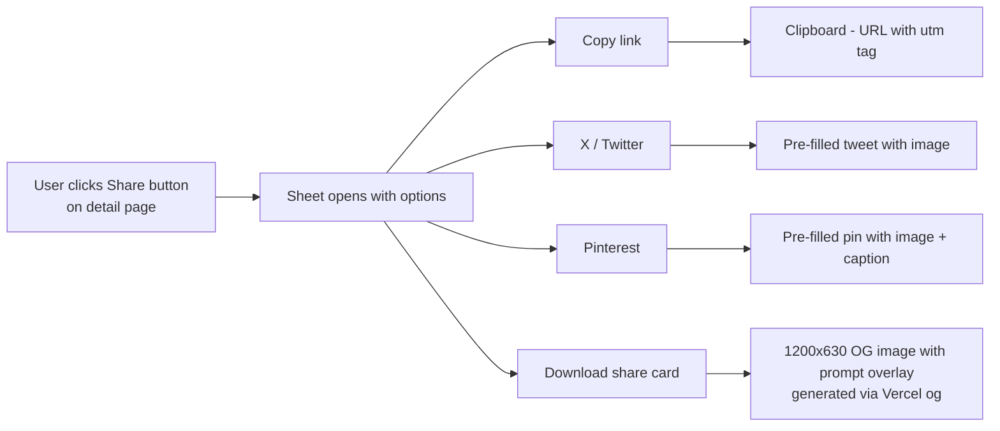
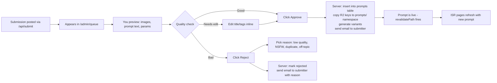

```mermaid
flowchart LR
    A[Free user uses site] --> B{Hits a premium-gated feature?}
    B -->|"Examples: Bulk export, API access, no ads, unlimited collections"| C["Inline soft paywall card<br/>Upgrade for 399 INR per month"]
    C --> D[Click Upgrade]
    D --> E[Redirect to /pricing]
    E --> F[Compare Free vs Premium]
    F --> G[Click Get Premium]
    G --> H{Logged in?}
    H -->|No| I[Auth required for billing]
    I --> J[Sign in via OAuth]
    J --> K[Razorpay Checkout - INR card or UPI]
    H -->|Yes| K
    K --> L[Pay - card or UPI]
    L --> M[Razorpay subscription.activated webhook]
    M --> N[Update users.plan = premium]
    N --> O[Redirect /account/billing?success=1]
    O --> P[Premium features unlocked everywhere]
```

# 03 — User Flows

> What real humans do on the site, step-by-step. Each flow has a journey diagram, a numbered walkthrough, edge cases, and the success metric we'd watch.

## Personas (Quick)

| Persona | Goal | Pattern |
|---------|------|---------|
| **The Hunter** (most users) | Find a great prompt RIGHT NOW | Land → search → copy → leave |
| **The Browser** | Discover inspiration | Land → scroll trending → click around → maybe save |
| **The Contributor** | Share their best prompts | Submit → wait for approval → return for stats |
| **The Power User** | Build a personal library | Sign up → favorite → collect → potentially go premium |
| **The Admin** (you) | Curate, moderate, grow | Login → review queue → approve/reject → feature |

## Flow Index

1. [Primary: Search → Copy (the 15-second flow)](#1-primary-search--copy)
2. [Browse by Category / Model](#2-browse-by-category--model)
3. [Submit a Prompt](#3-submit-a-prompt)
4. [Favorites (Anonymous → Logged-In Sync)](#4-favorites-flow)
5. [Premium Subscription](#5-premium-subscription)
6. [Remix a Prompt](#6-remix-a-prompt)
7. [Share a Prompt](#7-share-a-prompt)
8. [Admin: Moderate a Submission](#8-admin-moderate-a-submission)

---

## 1. Primary: Search → Copy

This is THE flow. ~80% of all sessions follow it. Optimizing this is the entire game.

### Journey



```mermaid
flowchart LR
    A[User searches in Google<br/>cinematic portrait flux] --> B[Lands on /prompt/cinematic-cyberpunk-portrait<br/>OR fluxprompts.io homepage]
    B --> C{Landed where?}
    C -->|Homepage| D[Types in hero search bar]
    C -->|Detail page| H[Sees image + prompt]
    D --> E[Live results render in 200ms]
    E --> F[Clicks a card]
    F --> G[Detail page loads]
    G --> H
    H --> I[Clicks Copy button or presses C]
    I --> J[Toast: Prompt copied!]
    J --> K[User pastes into Flux/MJ/etc]
    K --> L[Done - leaves site]
```

### Numbered Walkthrough

1. **Entry point** — User arrives via Google search, Pinterest, direct link, or homepage
2. **Search input** — On homepage, the hero is a single huge search bar. On other pages, the bar is in the header
3. **Live results** — As the user types (debounced 200ms), results appear without any page reload. Grid view is default; list view toggleable
4. **Filter (optional)** — User can narrow by Model (Flux, MJ, etc.), Category, Style. Active filters appear as pills they can click to remove
5. **Card click** — Clicking any card opens the prompt detail page. URL is SEO-friendly (`/prompt/cinematic-cyberpunk-portrait`)
6. **Detail page** — Hero image is large and beautiful. Prompt text is in a clean monospace box. Big lime "Copy Prompt" button is impossible to miss
7. **Copy** — Click button OR press `C` keyboard shortcut. Clipboard fills, toast confirms ("Prompt copied!")
8. **Leave / Stay** — Most users leave immediately to paste in their AI tool. Some continue browsing related prompts shown below

### Success Metrics

- **Time to copy** (from page load) — target < 8s p95
- **Copy rate** (copies / detail page views) — target > 35%
- **Bounce rate from detail page** — accept anything < 70% (this is a copy-and-leave product)

### Edge Cases

| Case | Handling |
|------|----------|
| Clipboard API unavailable (rare browsers) | Show fallback "Select All + Cmd/Ctrl+C" |
| User on iOS Safari (clipboard permission gotchas) | Use `document.execCommand` fallback |
| User clicks copy multiple times | Counter increments only once per session (cookie) |
| User has JS disabled | Server-rendered copy button uses `<form action>` with native copy via SSR-supplied "select-on-focus" textarea |
| Slow network | Show skeleton card placeholders during load |
| No results for query | Show "No prompts found for X. Try removing filters or browse Trending →" |

---

## 2. Browse by Category / Model

For users who don't have a specific query but want to explore.

### Journey

```mermaid
flowchart LR
    A[Lands on homepage] --> B[Sees category pills:<br/>Image Gen, Portraits, Logo,<br/>Product, Anime...]
    B --> C[Clicks Cinematic Portraits]
    C --> D[/category/cinematic-portraits page<br/>shows grid of prompts in this category]
    D --> E[Filters by Model = Flux Dev]
    E --> F[Sorts by Latest]
    F --> G[Scrolls grid]
    G --> H[Clicks a prompt]
    H --> I[Detail page]
    I --> J[Copy or favorite]
```

### Walkthrough

1. Homepage shows **category pills** (8–10 most popular categories) below search bar
2. Click a category pill → land on `/category/[slug]` (SSR + ISR cached)
3. Category page shows category description, sub-category pills (e.g. "Realistic", "Stylized"), filter bar, sorted grid
4. **Sort options:** Popular (default), Latest, Trending (last 7d copy_count)
5. **Filters available:** Model, Aspect Ratio, Style tag
6. Clicking a card → detail page (same as flow 1)

### Edge Cases

| Case | Handling |
|------|----------|
| Empty category | Hide the category pill entirely on homepage; show "Coming soon" if directly visited |
| Too many filters | If 0 results: "No prompts match. [Clear filters]" |
| User on mobile | Filters become a bottom sheet (`Sheet` component from shadcn/ui) |

---

## 3. Submit a Prompt

The contributor flow. Lower volume but vital for content scale.

### Journey



### Walkthrough

1. **Trigger** — User clicks "Submit" in top nav
2. **Auth gate (soft)** — Anonymous submissions allowed but notifications require email; encourage signup gently
3. **Form fields:**
   - Title (required, 10–80 chars)
   - Prompt text (required, multiline, monospace)
   - Negative prompt (optional, collapsed by default)
   - Model (dropdown: Flux Dev / Schnell / Pro, MJ, SD, DALL·E)
   - Category (dropdown)
   - Tags (chip input, autocomplete from existing tags)
   - Image dropzone (1–3, drag-drop or click)
   - Tips/notes (optional, multiline)
4. **Image upload UX:**
   - Drop image → instant client-side preview
   - Background upload to R2 via presigned URL
   - Each image shows progress bar + cancel button
   - On success: thumbnail with "remove" X
5. **Submit** — Validates, posts to `/api/submit`, redirects to `/submit/thank-you`
6. **Moderation** — You review in `/admin/queue`, approve or reject with reason
7. **Notification** — Approval triggers email via Resend with link to live prompt

### Success Metrics

- **Submission completion rate** (started → submitted) — target > 60%
- **Approval rate** — target > 80% (means our form is filtering well)
- **Time to first contribution** — measure for engaged users

### Edge Cases

| Case | Handling |
|------|----------|
| Image upload fails | Retry once automatically, then "Try again" button |
| Slow connection | Resumable uploads via tus protocol later (optional) |
| Same prompt submitted twice (same hash) | Detect on `/api/submit`, return "Already exists" with link |
| NSFW content | Cloudflare Images auto-tags potentially-NSFW; you review manually |
| Spam | Cloudflare Turnstile on form; rate-limit by IP (5 submissions/day anon, 20/day logged-in) |
| User abandons mid-form | LocalStorage draft auto-save every 5 seconds |

---

## 4. Favorites Flow

A core "stickiness" feature — works without login, syncs on signup.

### Journey



### Walkthrough

1. **Heart click** — On any prompt card, top-right heart icon
2. **Anonymous path:**
   - Save prompt ID to `localStorage['copyprompt:favorites']` array
   - Animate heart fill with lime accent
   - Show toast
3. **Logged-in path:**
   - POST to `/api/favorites`
   - Same UI feedback
4. **Favorites page** (`/favorites`):
   - Anon: read IDs from localStorage, batch-fetch prompt data via `/api/prompts/batch`
   - Logged-in: SSR list of favorited prompts
5. **Sync on signup:**
   - On post-signup screen, if localStorage has favorites: "Sync your saved prompts to your account?" → one-click button
   - POST `/api/favorites/sync` with array of IDs
   - Server upserts into DB

### Edge Cases

| Case | Handling |
|------|----------|
| LocalStorage full / disabled | Fall back to in-memory; warn user |
| User signs up with existing DB favorites | Merge dedup'd |
| User favorites a prompt that gets later deleted | Filter out on fetch (404 silently) |

---

## 5. Premium Subscription

The revenue path. Should feel optional, not pushed.

### Journey



### Walkthrough

1. **Discovery** — Free user encounters a premium feature card in context (NOT a popup):
   - Bulk export → "Export 50 prompts at once with Premium"
   - API access → "Get an API key with Premium"
   - Ads → tiny "No ads with Premium" link in footer
2. **Pricing page** — Side-by-side Free vs Premium comparison; single ₹399/month or ₹3,999/year option (~50% off annual)
3. **Checkout** — Razorpay Checkout (modal); we don't handle card data. UPI is the most common Indian payment method.
4. **Webhook** — Razorpay sends `subscription.activated` → server updates `users.plan = 'premium'`, sets `razorpay_subscription_id`
5. **Confirmation** — Redirect to `/account/billing?success=1` with celebration toast
6. **Cancellation** — User goes to `/account/billing` → "Cancel Subscription" → POST to `/api/billing/cancel` → server calls Razorpay API to cancel at period end

### Edge Cases

| Case | Handling |
|------|----------|
| Webhook fires before user returns | Account already has premium when they land |
| Webhook delayed | Poll `/api/account/me` every 2s for 10s; fall back to manual refresh prompt |
| Failed payment | Razorpay retries automatically per its dunning logic; we listen for `subscription.halted` |
| User churns | `subscription.cancelled` event → set `users.plan = 'free'` at period end; keep favorites/history |
| International user (USD) | Razorpay supports international cards (3% fee); offer USD pricing if expanding globally |

---

## 6. Remix a Prompt

A growth-loop feature: users iterate on existing prompts, improve them, contribute back.

### Journey



### Walkthrough

1. "Remix this Prompt" button on detail page
2. Goes to `/submit?remix_from=<prompt_id>` with form pre-filled
3. User tweaks the prompt and uploads their own generated image
4. On approval, the new prompt appears in:
   - Its own detail page
   - The original prompt's "Variations Gallery" section
5. Both prompts link to each other for SEO and discovery

---

## 7. Share a Prompt



The OG share image is **the** SEO superpower. Pinterest in particular loves these and drives massive long-tail traffic for image prompt sites.

---

## 8. Admin: Moderate a Submission



### Walkthrough

1. **Queue inbox** — `/admin/queue` shows pending submissions oldest-first
2. **Preview UI** — Shows the prompt as it would appear live + admin controls
3. **Decision** — Approve / Approve with edits / Reject with reason
4. **On approve:**
   - Insert row in `prompts` table with `status='published'`
   - Insert rows in `images` table; copy R2 keys from `uploads/` to `prompts/<id>/`
   - Trigger Cloudflare Images to generate variants
   - Set tags (insert into `prompt_tags`)
   - Send approval email via Resend
   - `revalidatePath('/category/...')`, `revalidatePath('/model/...')`
5. **On reject:**
   - Update submission row with `status='rejected'`, `rejection_reason`
   - Send rejection email
6. **Audit trail** — every action logged with `reviewer_id` + `reviewed_at`

### You Should Be Able To Process

A submission should take **30–60 seconds** to review when the form is well-designed. At that pace you can do 60 submissions per hour, supporting any volume a content site at this stage will see.

---

**Next:** [04-TECH-FLOWS.md](./04-TECH-FLOWS.md) — what the system is doing under the hood for each user action.
