# 04 — Technical Flows

> What the system does under the hood for each user action. Sequence diagrams + step-by-step technical walkthroughs.

## Flow Index
1. [Instant Search](#1-instant-search)
2. [Copy Prompt (with Telemetry)](#2-copy-prompt)
3. [Image Upload (Direct to R2)](#3-image-upload)
4. [Submission + Moderation Pipeline](#4-submission--moderation-pipeline)
5. [SSR + ISR Rendering for SEO](#5-ssr--isr-rendering)
6. [Auth Flow (Supabase OAuth)](#6-auth-flow)
7. [Razorpay Subscription Lifecycle](#7-razorpay-subscription-lifecycle)
8. [Free Flux Image Generation (Together AI)](#8-free-flux-image-generation)
9. [Favorites Sync (Anon → Logged-In)](#9-favorites-sync)
10. [Trending Refresh (Cron)](#10-trending-refresh)

---

## 1. Instant Search

The hot path. Should resolve in under 200ms p95.

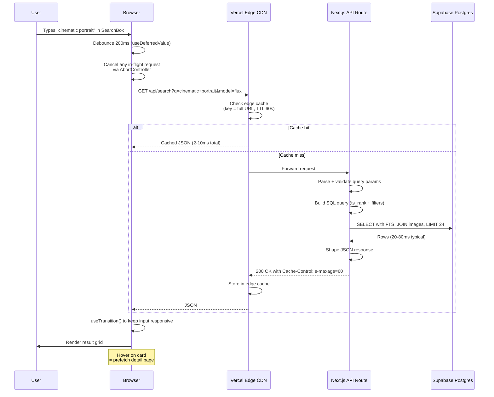

### Key Implementation Details
- **`websearch_to_tsquery`** parses Google-style queries (quotes, OR, -negation)
- **`ts_rank` weighting:** title (A) 1.0, prompt_text (B) 0.4, tips (C) 0.2
- **`AbortController`** cancels stale requests when user keeps typing
- **`useTransition`** ensures the input stays responsive even on slow renders
- **Edge cache key** includes full query string, so different filter combos cache independently
- **Pagination** via `OFFSET` is fine up to ~100 pages; beyond that switch to keyset pagination

### Performance Budgets
- p50: < 80ms
- p95: < 200ms
- p99: < 400ms

### Failure Modes
| Failure | Handling |
|---------|----------|
| DB timeout | Return 503; client shows "Search slow, retrying" toast and retries once |
| Edge cache miss + DB slow | Stream a fast empty placeholder, then hydrate when DB responds |
| Network drop | Show last-cached results; banner "You may be offline" |

---

## 2. Copy Prompt

The most-clicked button on the site. Designed for **zero-blocking UX** — feedback is instant, telemetry is fire-and-forget.

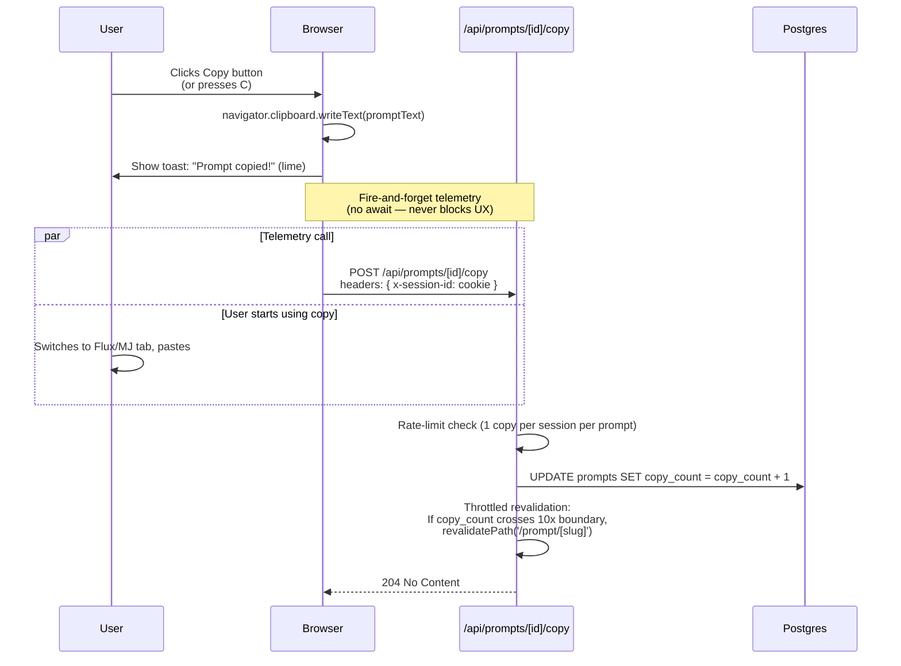

### Why Fire-and-Forget
- Clipboard write is synchronous in browsers — toast shows immediately
- Backend POST happens in parallel; if it fails, user doesn't care, the copy already worked
- This makes the experience feel instant even on slow networks

### Anti-Spam
- Session cookie tracks copies per prompt; only first counts
- Optional: increment a per-IP counter daily; if > 100 copies/min from one IP, return 429
- The counter is *intentionally fuzzy* — a 1% inflation is fine; this isn't a financial system

### Keyboard Shortcut
```typescript
useEffect(() => {
  const handler = (e: KeyboardEvent) => {
    if (e.key === 'c' && !e.metaKey && !e.ctrlKey 
        && document.activeElement?.tagName !== 'INPUT'
        && document.activeElement?.tagName !== 'TEXTAREA') {
      copyPrompt();
    }
  };
  window.addEventListener('keydown', handler);
  return () => window.removeEventListener('keydown', handler);
}, [promptText]);
```

---

## 3. Image Upload

Direct-to-R2 upload with presigned URLs. **The browser uploads directly to Cloudflare** — never through your server.

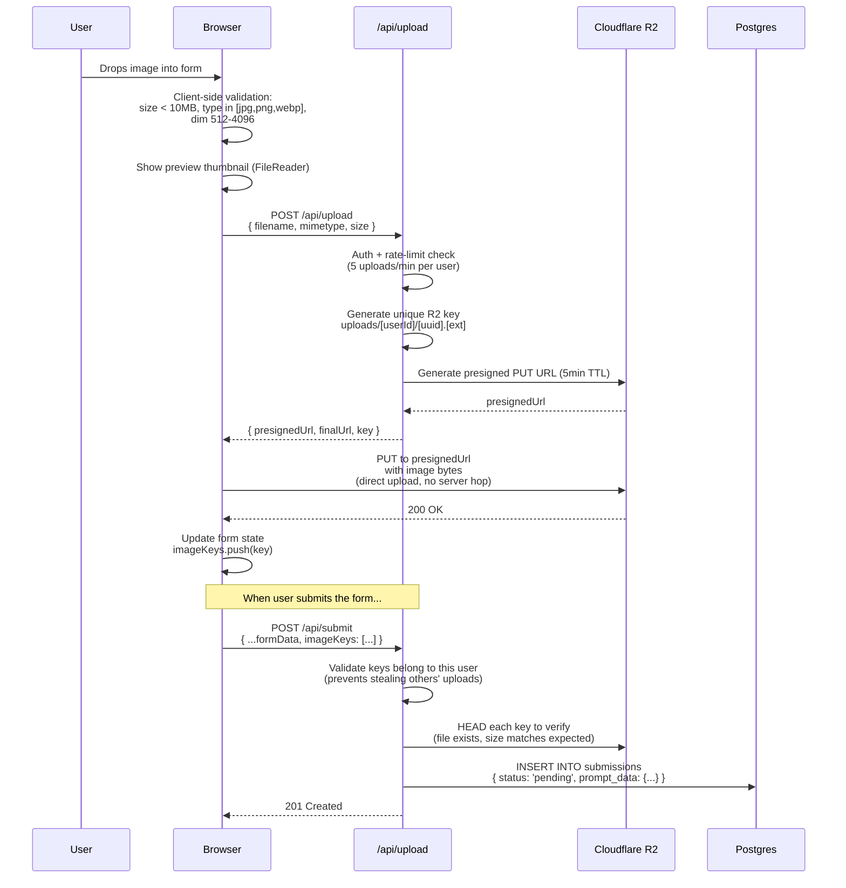

### Why Direct-to-R2 (vs through your server)
- **Bandwidth:** Vercel functions have a 4.5 MB body limit on Hobby tier; large images would fail
- **Cost:** Zero egress through your serverless function = lower bills
- **Speed:** User uploads to nearest CF edge directly = faster than via Vercel
- **Memory:** Your function never holds the bytes = less memory pressure

### Security
- Presigned URL has 5-minute TTL
- Path includes `userId` so a malicious user can't write to others' folders
- Server validates `ownership` of the key by reading the path before linking it to a submission
- Cloudflare bucket has CORS restricted to your domain

### On Submission Approval
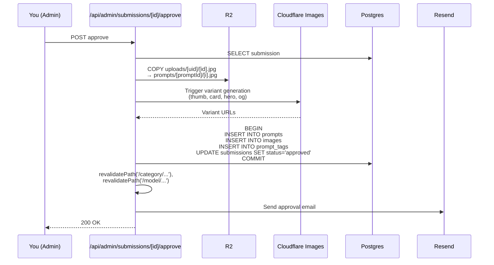

---

## 4. Submission + Moderation Pipeline

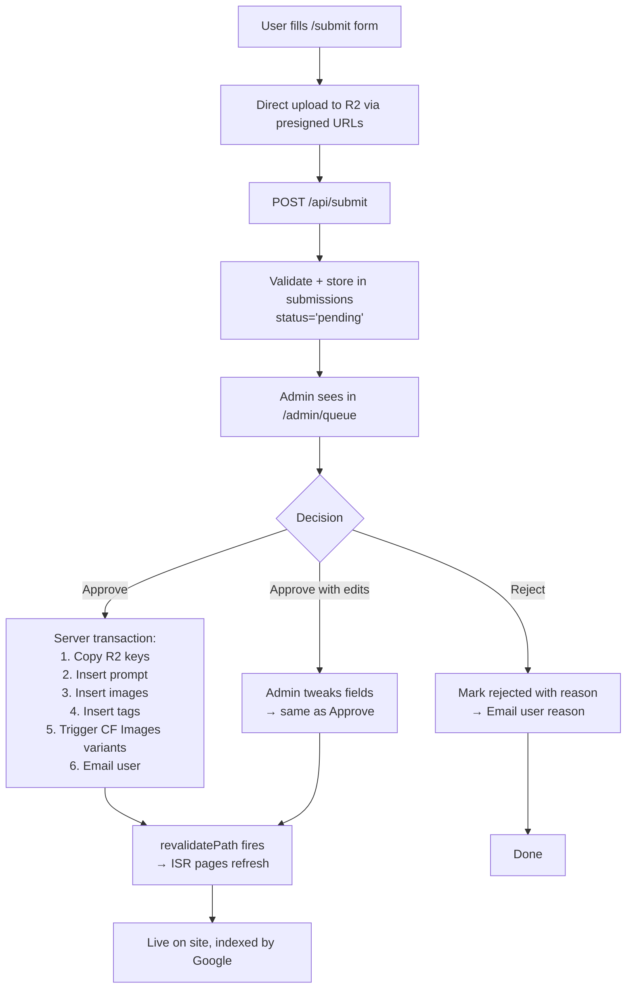

### Idempotency
The approve operation is wrapped in a Postgres transaction. If anything fails (e.g. CF Images is down), the entire approval rolls back and the admin can retry.

### Race Conditions
- Two admins approving simultaneously → use `SELECT ... FOR UPDATE` on the submission row
- Slug collision → submission stores a tentative slug; on approve, server appends `-2`, `-3` etc. if taken

---

## 5. SSR + ISR Rendering

Pre-rendered HTML is **the SEO superpower**. Detail pages are statically generated then revalidated periodically.

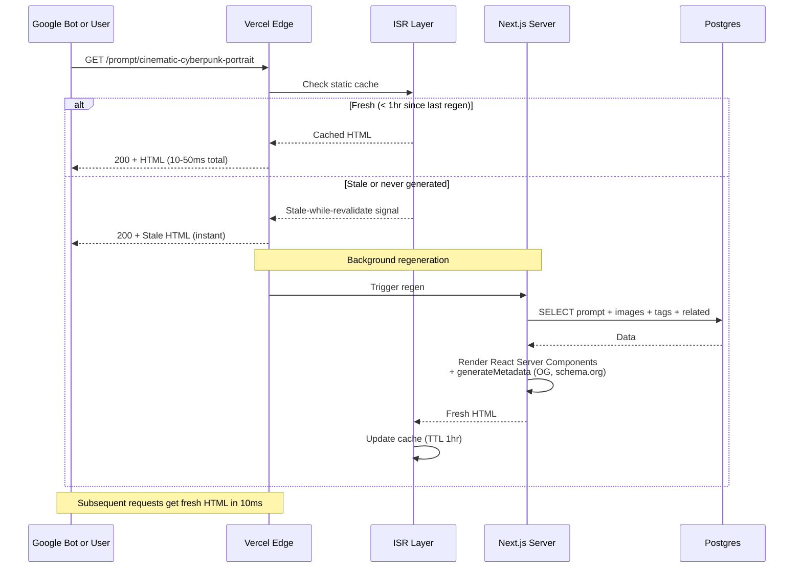

### Why ISR (Not pure SSR)
- **5,000+ pages** can't all be SSG'd at build time (slow builds, expensive)
- **ISR pre-renders on first hit**, then serves cache for 1hr → 99% of requests skip the DB entirely
- **Stale-while-revalidate** means even cache miss returns instantly (with stale content) and refreshes in background

### On-Demand Revalidation
Triggered when:
- New submission approved → `revalidatePath('/category/[slug]')`
- Prompt copy_count crosses 10x threshold → `revalidatePath('/prompt/[slug]')` to update display count
- Daily cron at 3 AM → revalidate homepage trending grid

### Schema.org Markup Embedded
```html
<script type="application/ld+json">
{
  "@context": "https://schema.org",
  "@type": "ImageObject",
  "name": "Cinematic Cyberpunk Portrait",
  "description": "...",
  "contentUrl": "https://cdn.fluxprompts.io/...",
  "creator": { "@type": "Organization", "name": "CopyPrompt" },
  "license": "https://fluxprompts.io/license"
}
</script>
```

---

## 6. Auth Flow

Supabase Auth via OAuth. Magic links also supported as fallback.

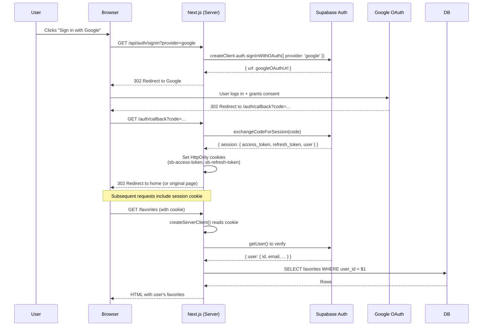

### Session Storage
- Tokens stored in **HttpOnly Secure cookies** (XSS-safe, CSRF-token-protected)
- Access token TTL: 1 hour
- Refresh token TTL: 30 days, sliding window
- On expiry, middleware silently refreshes via Supabase client

### Magic Link Fallback
For users who don't want OAuth:
1. User enters email → POST `/api/auth/magic-link`
2. Server calls `supabase.auth.signInWithOtp({ email })`
3. Resend delivers email with link
4. Click link → `/auth/callback?token_hash=...&type=magiclink`
5. Same callback handler exchanges for session

### Anonymous Mode
Most of the site works without auth. Auth is only required for:
- `/submit` (optional — allow anon with email)
- `/favorites/sync`
- `/account/*`
- `/admin/*`

---

## 7. Razorpay Subscription Lifecycle

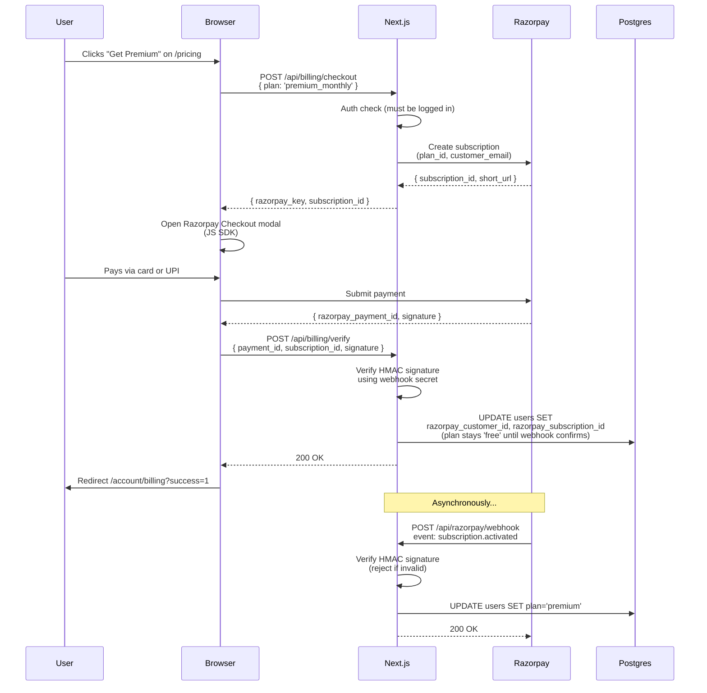

### Webhook Events We Handle
| Event | Action |
|-------|--------|
| `subscription.activated` | Set `plan = 'premium'` |
| `subscription.charged` | Log payment for billing history |
| `subscription.halted` | Failed payment retries exhausted → `plan = 'free'`, send email |
| `subscription.cancelled` | User canceled → `plan = 'free'` at period end |
| `payment.failed` | Log; Razorpay handles retries |

### Idempotency
- Razorpay sends webhooks at-least-once → we dedupe by `event.id` in a `webhook_events` table
- All updates use `ON CONFLICT DO NOTHING` for idempotent inserts

### Verification (Critical Security)
```typescript
const expected = crypto
  .createHmac('sha256', process.env.RAZORPAY_WEBHOOK_SECRET)
  .update(rawBody)
  .digest('hex');
if (expected !== request.headers.get('x-razorpay-signature')) {
  return new Response('Invalid signature', { status: 401 });
}
```

---

## 8. Free Flux Image Generation

How we generate seed images for ₹0 using Together AI's free Flux Schnell tier.

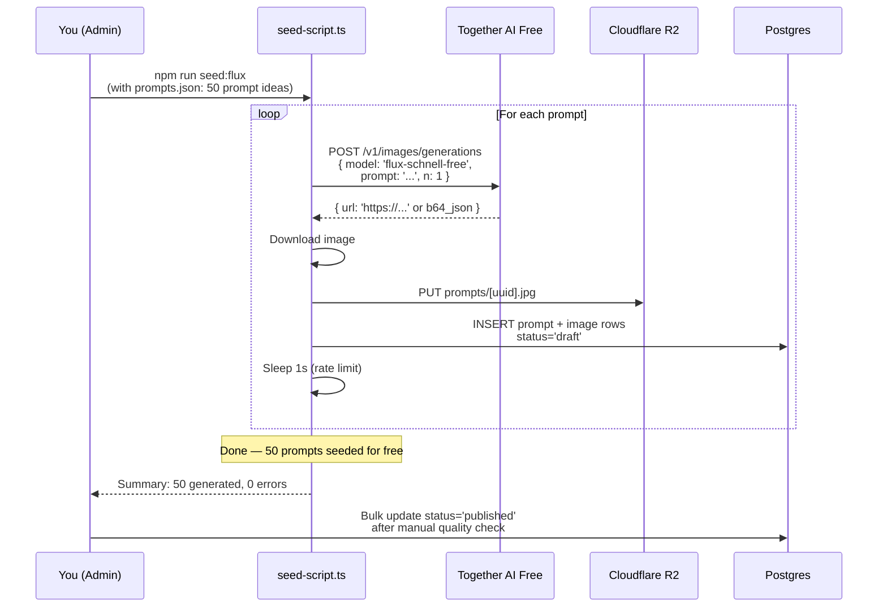

### Free Tier Limits (Together AI)
- 60 RPM (1 request/second)
- 6,000 RPD (6,000 images/day)
- Plenty for 200/month seeding

### Backup: Pollinations.ai
For when you want zero-auth, instant generation:
```typescript
const url = `https://image.pollinations.ai/prompt/${encodeURIComponent(prompt)}?model=flux&nologo=true`;
// fetch + save to R2
```

### Quality Tier (Optional, Paid)
For "hero" prompts where you want Flux Dev quality:
- Use fal.ai or Replicate ($1 free signup credits)
- ~₹2/image
- Reserve for top 50 most-featured prompts

---

## 9. Favorites Sync (Anon → Logged-In)

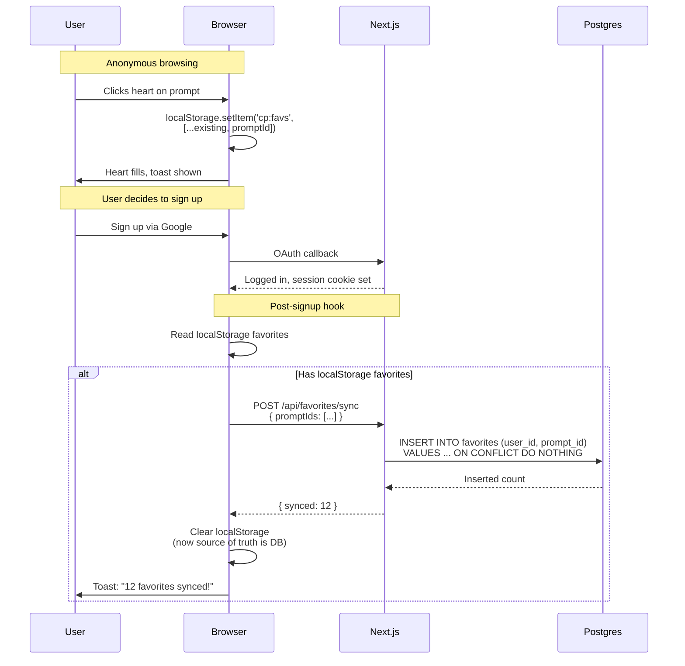

---

## 10. Trending Refresh (Cron)

Computed once per hour, cached for everyone.

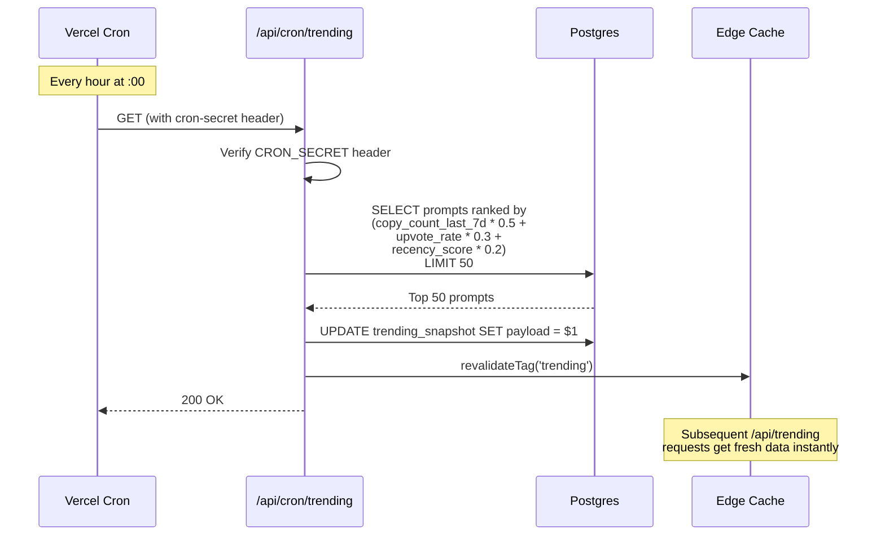

### Why Snapshot Table (Not Live Query)
- Trending query joins multiple tables and does aggregation → ~200-500ms
- Running it on every homepage hit would crush DB at scale
- Snapshot table lets `/api/trending` be a simple `SELECT * FROM trending_snapshot` (~5ms)

### Vercel Cron Configuration
```json
// vercel.json
{
  "crons": [
    { "path": "/api/cron/trending", "schedule": "0 * * * *" },
    { "path": "/api/cron/sitemap-refresh", "schedule": "0 3 * * *" },
    { "path": "/api/cron/keepalive-supabase", "schedule": "0 */3 * * *" }
  ]
}
```

> **Note:** The `keepalive-supabase` cron is a workaround for the Supabase free tier's 7-day inactivity pause. A simple `SELECT 1` every 3 hours keeps it warm.

---

**Next:** [05-UI-MOCKUPS.md](./05-UI-MOCKUPS.md) — what every screen looks like (ASCII layouts + component specs).
