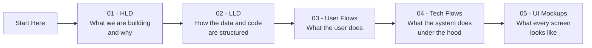
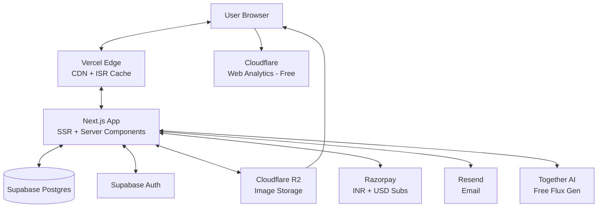

# CopyPrompt — Design Documentation

This folder contains the complete design for **CopyPrompt** — a Flux-first AI image prompt site, optimized as a side-income project.

> Open these files in any markdown viewer that supports **Mermaid** (Cursor, VS Code with Markdown Preview Mermaid Support extension, GitHub, Obsidian, etc.) to see the diagrams render visually.

## How to Read These Docs

## Documents

| # | File | What It Covers | Audience |
|---|------|----------------|----------|
| 01 | [01-HLD.md](./01-HLD.md) | System architecture, tech stack, components, scaling, costs | You as product owner |
| 02 | [02-LLD.md](./02-LLD.md) | Database schema, API endpoints, page routes, search/image internals | You as engineer |
| 03 | [03-USER-FLOWS.md](./03-USER-FLOWS.md) | Visitor → search → copy, submit, favorites, premium subscribe | UX understanding |
| 04 | [04-TECH-FLOWS.md](./04-TECH-FLOWS.md) | Sequence diagrams for search, copy, upload, auth, SSR/ISR | Engineering deep-dive |
| 05 | [05-UI-MOCKUPS.md](./05-UI-MOCKUPS.md) | ASCII layouts + component specs for every page | Visual / UI layer |

## Project at a Glance

- **Name:** CopyPrompt (working name; final domain TBD)
- **Niche:** Flux-first AI image prompts (expand to MJ, SD, DALL·E in Month 6+)
- **Vision:** Open → search → copy → paste into AI tool in **under 15 seconds**
- **Promise:** Free forever for users, no signup walls, dark mode default
- **Income target Year 1:** ₹40,000 – ₹1,70,000 / month (side project, ~12 hrs/week)
- **Build cost target:** **₹0/month for Months 1–4** (free tiers); ~₹1,700–₹8,000/month after monetization turns on
- **Stack:** Next.js 15 + TypeScript + Tailwind + shadcn/ui, Supabase, Cloudflare R2, Vercel (Hobby → Pro), Razorpay

## High-Level Architecture (Quick View)

## Design Principles (the Constraints That Drive Every Decision)

1. **Speed is the product.** If a page takes >1 sec to interactive, we've failed.
2. **No friction.** No login walls, no popups, no email gates for the core flow.
3. **SEO is feature #1.** Every page must be server-rendered with proper meta tags and schema.org markup.
4. **Mobile-first.** Most users will be on phones, copying prompts while in another AI tool.
5. **Lean ops.** A solo builder must be able to run this for **₹0/month** in early stages and **<₹8,000/month** even at significant scale.
6. **Image-first UX.** For an image prompt site, the imagery is the headline — not the text.

## Status

- [x] Niche selected (Flux-first image prompts)
- [x] Tech stack chosen
- [x] HLD complete
- [x] LLD complete
- [x] User flows mapped
- [x] Technical flows mapped
- [x] UI mockups specified
- [ ] Implementation (awaiting your go-ahead to switch to agent mode)
